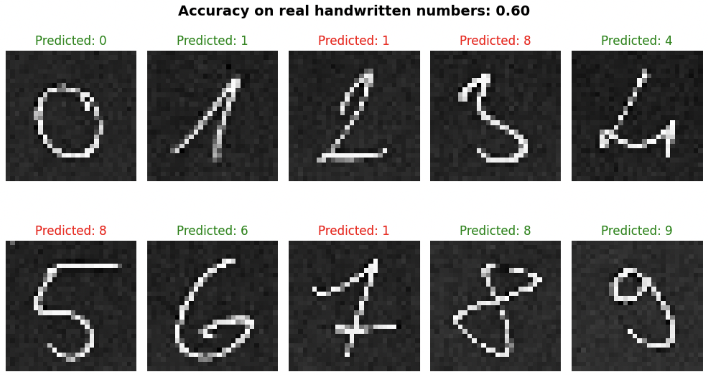

# geom_data_analysis

## Demonstrate how can a poorly performing solution be enhanced to a well performing one on a handwritten digit recognition task.

> Detailed description is in the notebook.

- From a poorly performing solution:

- Mid solution

- To this improved solution:

